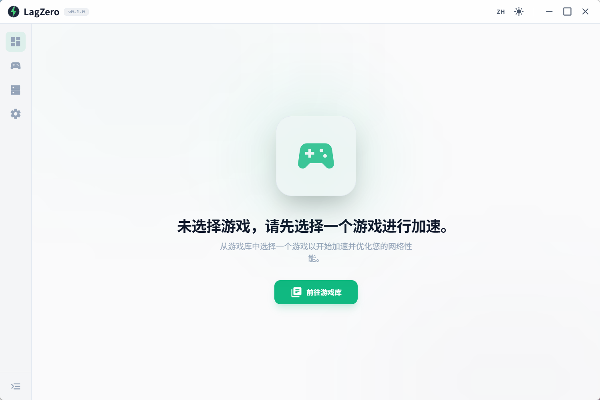
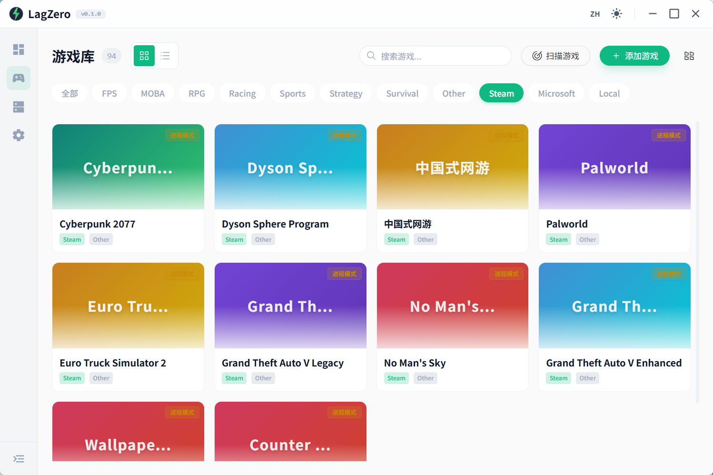
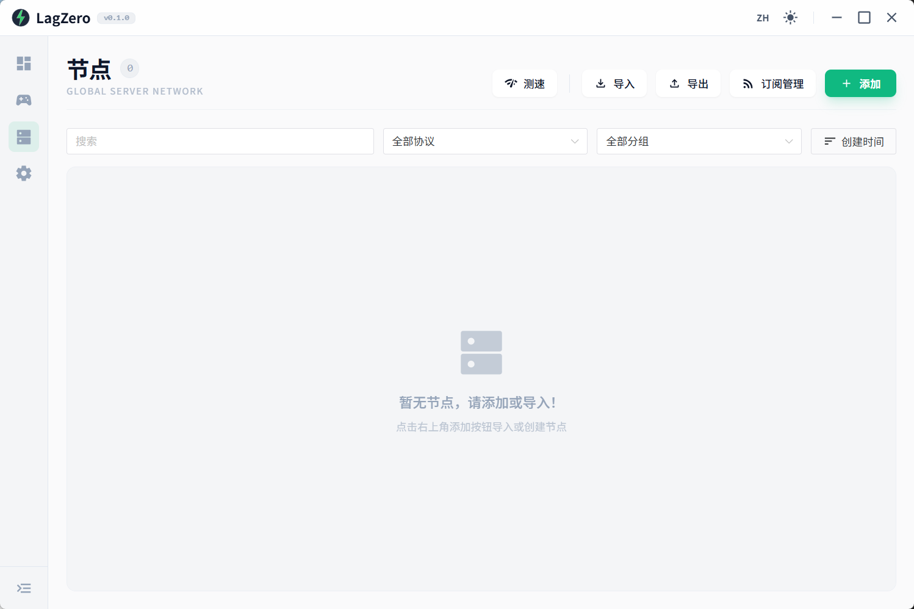
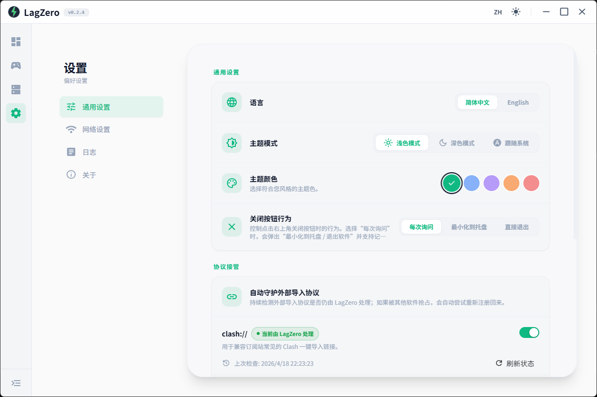

#  LagZero

[](https://vuejs.org/)
[](https://www.electronjs.org/)
[](https://www.typescriptlang.org/)
[](https://unocss.dev/)
[](LICENSE)

**LagZero** 是一款专为游戏体验打造的游戏加速器。基于 **Vue 3**、**TypeScript** 和 **Electron** 构建，底层集成强大的 **sing-box** 核心，旨在提供最低延迟、最稳定的网络加速方案。

---

## ✨ 核心特性

- 🚀 **极速性能**: 底层采用高性能 **sing-box** 网络核心，支持多协议节点加速，确保毫秒级响应。
- 🎨 **现代美学**: 深度定制的 **Vue 3** + **Naive UI** 设计风格，提供极致的暗色模式与自定义主题色体验。
- 🎮 **智能游戏库**: 自动扫描并识别本地游戏（Steam、Xbox 等），一键配置加速。
- 🛠️ **精细化控制**: 独创的 **Process Proxy** 进程追踪技术，搭配 TUN 虚拟网卡模式，实现进程级路由分流。
- 🌐 **多协议支持**: 全面支持 Shadowsocks, VMess, VLESS, Trojan, TUIC, Hysteria2 等主流与新兴代理协议。
- 🔌 **本地代理系统**: 内置本地 HTTP/SOCKS 代理服务，支持 PAC 自动代理配置脚本。
- 📊 **流量可视化**: 实时网络延迟测试、节点状态监测与流量统计图表（基于 ECharts）。
- 📦 **开箱即用**: 内置 sing-box 核心自动管理，支持代理订阅自动更新与节点订阅解析。

---

## 📸 界面预览

<p align="center">
  
  
</p>
<p align="center">
  
  
</p>

---

## 🛠️ 技术栈

- **前端**: Vue 3 (Composition API), Pinia, Vue Router, Naive UI
- **样式**: UnoCSS (Atomic CSS), Sass
- **桌面**: Electron
- **网络核心**: sing-box
- **数据库**: SQLite (Better-SQLite3 + Kysely)
- **构建工具**: Vite, Electron Builder

---

## 🚀 快速开始

### 环境与依赖

- **Node.js**: 18.x 或更高版本 (推荐使用 LTS 版本)
- **包管理器**: [pnpm](https://pnpm.io/) (必须使用 pnpm)

### 安装与运行流程

```bash
# 1. 获取代码并进入工作区 (前提)
# git clone https://github.com/ZenEcho/LagZero.git
# cd LagZero

# 2. 安装所有的 Node 依赖项
pnpm install

# 3. 重新编译原生模块 (极度关键！因为依赖了 Better-SQLite3，必须要适配 Electron 的 Node ABI)
pnpm rebuild:native
# 备用命令：如果你在上方重构过程中卡住，可尝试专用的数据库重建脚本
# pnpm rebuild:sqlite

# 4. 启动开发模式 (包含 Vite 热更新界面与 Electron 主进程热重载)
pnpm dev
```

### 源码编译与打包构建

LagZero 配备了齐全的 `package.json` 构建脚手架命令，可直接调用处理打包分发任务：

| `pnpm` 任务指令 | 执行说明                                                                                                     |
| :-------------- | :----------------------------------------------------------------------------------------------------------- |
| `build`         | 纯前端侧的**生产编译**（执行 `vue-tsc` 类型检查后输出网页 `dist` 资产）                                      |
| `pack`          | 将程序打包为对应平台的**免安装目录** (`Unpacked`)，适合用来调试真实的打包环境                                |
| `dist`          | 直接将应用封包为当前平台的常规**安装包** (`Installer`/`.exe`/`.dmg`/`.AppImage`等)                           |
| `dist:win:all`  | **(Windows 发布必用)** 全量打包构建 `x64` 和 `arm64` 架构下的 **NSIS安装程序** 与 **Portable便携单文件版本** |

_(提示：你还可以从 `package.json` 中发现更细粒度的构建宏，如仅打 x64 便携版 `dist:win:x64:portable`)_

---

## 📂 项目结构

```text
├── .github/          # GitHub Actions 自动化配置
├── docs/             # 项目文档 (API, 用户手册等)
├── docImages/        # 文档相关配图目录
├── electron/         # Electron 主进程源码
│   ├── common/       # 主进程与渲染进程共享常量 / 类型
│   ├── db/           # 本地 SQLite 数据表结构与迁移
│   ├── main/         # 进程入口与窗口生命周期管理
│   ├── preload/      # 预加载脚本 (ContextBridge 桥接 API)
│   ├── services/     # 核心服务 (代理引擎, 节点解析, 游戏扫描等)
│   ├── stores/       # 本地数据持久化与配置存储
│   └── utils/        # 主进程通用工具函数库
├── public/           # 静态资源 (应用图标等，无须编译构建)
├── src/              # 渲染进程 (Vue 源码)
│   ├── api/          # 接口请求封装
│   ├── assets/       # 全局样式与图片资源
│   ├── components/   # 全局和基础 UI 组件
│   ├── composables/  # Vue 组合式公共函数 (Hooks)
│   ├── constants/    # 前端静态枚举与常数定义
│   ├── layouts/      # 基础页面布局框架
│   ├── locales/      # 多语言国际化配置 (i18n)
│   ├── router/       # Vue Router 路由配置
│   ├── stores/       # Pinia 全局状态管理
│   ├── types/        # 前端 TypeScript 接口与类型定义
│   ├── utils/        # 前端通用辅助工具类
│   └── views/        # 主体业务视图与页面
└── tests/            # 单元测试与端到端测试目录
```

---

## ❓ 常见问题

### 原生模块 ABI 报错

由于使用了 `better-sqlite3` 等原生模块，如果遇到 `NODE_MODULE_VERSION` 冲突，请尝试：

**Windows (PowerShell):**

```powershell
$env:npm_config_runtime='electron'; $env:npm_config_target='40.2.1'; $env:npm_config_disturl='https://electronjs.org/headers'; pnpm rebuild better-sqlite3
```

---

## 📜 许可协议

本项目采用 [MIT License](LICENSE) 开源。

---

## 🤝 贡献与反馈

欢迎提交 Issue 或 Pull Request 来完善 LagZero！

- **仓库**: [GitHub/ZenEcho/LagZero](https://github.com/ZenEcho/LagZero)
- **文档**: 详见 [docs](./docs) 目录
