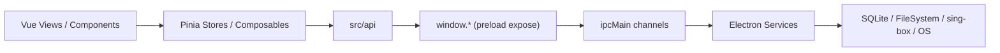

# LagZero 开发文档

这组文档面向参与 **LagZero** 开发、联调、打包和发布验证的同学，基于当前仓库代码整理。项目整体是一个 `Vue 3 + Vite + Electron` 桌面应用，业务核心围绕游戏库、节点管理、sing-box 加速链路、本地代理、系统代理、托盘与订阅深链导入展开。

## 文档导航

| 文档 | 适用场景 |
| --- | --- |
| [development-guide.md](./development-guide.md) | 新同学接手、环境准备、启动流程、发布流程 |
| [project-structure.md](./project-structure.md) | 先快速建立仓库地图，定位关键目录与关键文件 |
| [module-usage.md](./module-usage.md) | 想扩展模块、串联调用链、增加 IPC / store / service |
| [release-checklist.md](./release-checklist.md) | 接近发布时做回归验证、打包检查和最终确认 |
| [subscription-deep-link.md](./subscription-deep-link.md) | 网页一键导入订阅、协议注册、深链参数说明 |

## 架构概览

## 当前代码分层

- `src/`：渲染进程，负责页面、状态管理、配置生成与 UI 交互
- `electron/`：主进程，负责窗口、托盘、IPC、数据库、系统能力、协议注册与 sing-box 生命周期
- `shared/`：主进程与渲染进程共用的类型和纯函数工具
- `tests/unit/`：Vitest 单元测试，覆盖协议解析、扫描器、深链、代理逻辑与配置生成

## 当前维护重点

- Windows 打包与运行时数据目录行为
- sing-box 核心安装、版本偏好与安装器守卫
- 本地代理与游戏加速共用 sing-box 进程时的状态一致性
- `lagzero://`、`clash://`、`mihomo://` 的协议注册与守护
- 订阅解析、网页一键导入与单实例深链转发

## 推荐阅读顺序

1. [development-guide.md](./development-guide.md)
2. [project-structure.md](./project-structure.md)
3. `electron/main/index.ts`
4. `electron/preload/index.ts`
5. `src/main.ts`
6. `src/stores/`
7. [module-usage.md](./module-usage.md)
8. [release-checklist.md](./release-checklist.md)

## 文档维护约定

- 新增 IPC、store、service、scanner、深链参数或设置项时，优先同步更新这里和对应专题文档
- 文档里的目录树保持“开发视角”的精简版，不展开构建产物、依赖目录与本地 IDE/AI 工具目录
- 如果行为依赖平台差异，请在文档中明确标出当前是否仅对 Windows 做了完整实现或验证
