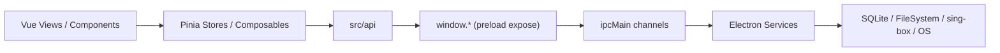

# LagZero 开发文档

本文档面向参与 LagZero 开发与维护的同学，基于当前仓库代码整理。项目整体是一个 `Vue 3 + Vite + Electron` 的桌面应用，业务核心围绕游戏库、节点管理、sing-box 加速链路、本地代理与系统代理控制展开。

## 文档导航

- [development-guide.md](./development-guide.md): 环境准备、常用命令、启动流程、日常开发建议
- [project-structure.md](./project-structure.md): 仓库目录树、关键目录职责、推荐阅读顺序
- [module-usage.md](./module-usage.md): 前端模块、Electron 服务、常见调用方式与扩展路径

## 架构概览

## 当前代码分层

- `src/`: 渲染进程，负责页面、状态管理、配置生成与 UI 交互
- `electron/`: 主进程，负责窗口、托盘、IPC、数据库、系统能力与 sing-box 生命周期
- `shared/`: 主进程与渲染进程共用的类型和纯函数工具
- `tests/unit/`: 以 Vitest 为主的单元测试

## 阅读建议

如果是第一次接手项目，建议按下面顺序阅读：

1. [development-guide.md](./development-guide.md)
2. [project-structure.md](./project-structure.md)
3. `electron/main/index.ts`
4. `electron/preload/index.ts`
5. `src/main.ts`
6. `src/stores/`
7. [module-usage.md](./module-usage.md)

## 说明

- 文档中的目录树是“开发视角”的精简版，刻意省略了 `node_modules`、构建产物与本地工具目录。
- 若后续新增 IPC、store、scanner 或设置项，建议同步更新这组文档。
