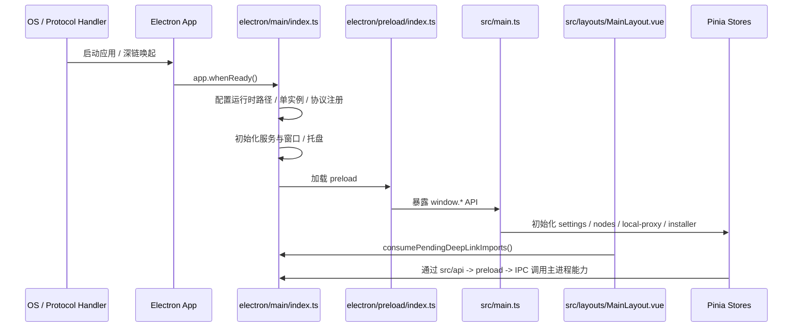

# LagZero 开发指南

## 1. 项目定位

LagZero 是一个面向游戏加速场景的桌面客户端，当前仓库的主要组成如下：

- 渲染进程：`Vue 3 + Pinia + Vue Router + Naive UI + UnoCSS`
- 主进程：`Electron`
- 网络内核：`sing-box`
- 数据存储：`better-sqlite3 + Kysely`
- 测试：`Vitest + happy-dom`

从当前代码实现看，系统级能力和回归验证主要围绕 **Windows** 展开，尤其是下面这些能力：

- 管理员权限自提权
- TUN 网卡重装
- 系统代理设置与恢复
- 本地游戏平台扫描
- 自定义协议注册与协议守护
- 打包版数据目录迁移

## 2. 环境准备

### 基础要求

- Node.js `18+`
- `pnpm`
- Windows 下调试 TUN、系统代理、协议注册时，建议以管理员身份运行开发环境

### 安装与启动

```bash
pnpm install
pnpm rebuild:native
pnpm dev
```

### 为什么一定要执行 `pnpm rebuild:native`

项目依赖 `better-sqlite3`，它是原生模块。Electron 的 Node ABI 与普通 Node.js 不一致，如果不重建，很容易在启动阶段遇到 ABI 不匹配或架构不匹配错误。

如果已经触发启动错误，可以优先尝试：

```bash
pnpm rebuild:native
```

必要时再尝试：

```bash
pnpm rebuild:sqlite
```

## 3. 常用命令

| 命令 | 作用 | 备注 |
| --- | --- | --- |
| `pnpm dev` | 启动 Vite + Electron 开发环境 | 默认同时启动渲染进程与桌面壳 |
| `pnpm build` | 执行 `vue-tsc -b` 后构建渲染进程产物 | 仅构建前端产物 |
| `pnpm preview` | 预览渲染进程构建结果 | 不包含 Electron 主进程 |
| `pnpm test` | 运行 Vitest 单元测试 | 适合发版前做快速回归 |
| `pnpm pack` | 打包为未安装目录 | 适合验证桌面行为与资源路径 |
| `pnpm dist` | 构建当前平台安装包 | 走 Electron Builder |
| `pnpm dist:win:all` | 构建 Windows x64 / arm64 的 NSIS 与 Portable 包 | 当前正式发布最常用 |
| `pnpm rebuild:native` | 重建 Electron 原生依赖 | 首次拉起、换 Electron 版本后必跑 |
| `pnpm rebuild:sqlite` | 单独重建 `better-sqlite3` | 排障备用 |

## 4. 运行时路径与数据目录

LagZero 目前在不同运行形态下使用不同的数据目录策略：

| 运行形态 | `userData` 路径 | 说明 |
| --- | --- | --- |
| 开发模式 | `<repo>/.lagzero-dev/` | 便于在仓库内观察运行时数据 |
| Windows 打包版 | `<exe-dir>/data/` | 安装版和便携版都优先使用随程序目录 |
| 其他打包环境 | Electron 默认 `app.getPath('userData')` | 仍保留 Electron 默认行为 |

补充说明：

- Windows 打包版会把 `sessionData`、`logs`、`crashDumps` 也尽量落到 `data/` 下
- 当 `data/` 为空时，主进程会尝试从旧版 `AppData\\Roaming` 目录迁移历史数据
- Portable 运行时默认不会在启动早期强制提权，避免便携版在自提权链路中拉起失败
- 协议注册、协议守护、数据迁移等行为，建议优先在打包版中验证

## 5. 启动流程

### 主进程启动

`electron/main/index.ts` 是主进程总入口，当前主要负责：

- 配置运行时数据目录与旧数据迁移
- 处理 deep link 场景下的提权时机和单实例锁
- 初始化日志、CrashReporter、CSP 与窗口/托盘
- 注册 `lagzero://`、`clash://`、`mihomo://` 协议
- 初始化 `DatabaseService`、`SingBoxService`、`SystemService`、`UpdaterService` 等核心服务
- 启动协议守护定时器，确保兼容协议仍归 LagZero 处理

### 预加载桥接

`electron/preload/index.ts` 通过 `contextBridge` 暴露下面几类 API：

- `window.electron`
- `window.singbox`
- `window.system`
- `window.proxyMonitor`
- `window.nodes`
- `window.games`
- `window.categories`
- `window.app`
- `window.logs`

渲染进程不应该直接接触 `ipcRenderer`，统一通过 preload 暴露层与 `src/api/` 调用。

### 渲染进程启动

`src/main.ts` 负责：

- 初始化运行时日志与延迟会话存储
- 挂载 `router`、`pinia`、`i18n`
- 初始化 sing-box 安装器 store
- 在主窗口中启动本地代理自动拉起逻辑
- 监听节点数量、本地代理状态和核心版本偏好变化
- 对托盘窗口 `#/tray` 做特判，避免运行主窗口专属副作用

### 启动顺序图



## 6. 开发时常见工作流

### 新增一个前端功能

推荐顺序：

1. 先确认数据结构是否需要放进 `shared/types/`
2. 页面级状态优先放进 `store`，复用逻辑优先放进 `composable`
3. 如需主进程能力，先在 `preload` 和 `src/api` 打通桥接
4. 页面组件只消费 `store` / `composable`，不要在页面层直接拼 IPC

### 新增一个 Electron 能力

推荐顺序：

1. 在 `electron/services/` 新建或扩展服务
2. 在服务中注册 `ipcMain.handle(...)`
3. 在 `electron/preload/index.ts` 暴露到 `window.*`
4. 在 `src/api/*.ts` 增加薄封装
5. 在 `store` 或 `composable` 中消费

### 新增一个设置项

推荐落点：

- 持久化设置：`src/stores/settings.ts`
- 设置界面：`src/components/settings/`
- 如会影响加速流程：同步检查 `src/stores/games.ts`、`src/stores/local-proxy.ts`、`src/utils/singbox-config.ts`

### 新增一个深链动作或参数

推荐顺序：

1. 修改 `electron/main/deep-link.ts`
2. 如涉及协议注册或守护策略，检查 `electron/main/protocol-client.ts`
3. 在 `src/layouts/MainLayout.vue` 或 `src/stores/nodes.ts` 完成消费链路
4. 同步更新 `tests/unit/deep-link.spec.ts`
5. 如牵涉 Clash 订阅解析，再同步更新 `tests/unit/protocol.spec.ts`

### 新增一个游戏平台扫描器

推荐顺序：

1. 在 `electron/services/scanners/` 新增扫描器
2. 在 `electron/services/game-scanner.ts` 注册来源
3. 复用 `dedupeProcessNames`、`normalizeFsPath`、`mapWithConcurrency` 等工具
4. 通过 `useGameScanner()` 触发扫描，并让 `gameStore` 负责入库

## 7. 发布构建流程

接近发布阶段，建议按下面顺序执行：

```bash
pnpm install
pnpm rebuild:native
pnpm build
pnpm test
pnpm pack
pnpm dist:win:all
```

补充说明：

- 产物默认输出到 `release/<version>/`
- `pnpm pack` 适合先验证资源路径、协议注册、托盘与数据目录行为
- `pnpm dist:win:all` 会构建 Windows 的 NSIS 安装包和 Portable 包
- 协议注册、协议守护、开机后数据目录迁移等行为，最好在打包产物中验证，不建议只靠开发模式判断

更细的发布确认项见 [release-checklist.md](./release-checklist.md)。

## 8. 测试与验证

### 单元测试

```bash
pnpm test
```

当前单元测试重点覆盖：

- 协议解析与 Clash 配置导入
- deep link 解析与协议注册辅助逻辑
- 启动前提权与原生模块报错格式化
- 游戏扫描器与扫描工具
- sing-box 配置生成
- 代理监控与进程树处理
- 主题与本地 store 工具

### 手动验证建议

- 首次启动是否能正常显示主窗口、侧边栏与托盘
- sing-box 核心缺失时，安装器守卫是否能正确引导安装
- 节点导入、节点测速、订阅刷新、Clash YAML / Base64 解析
- 网页一键导入订阅：`lagzero://`、`clash://install-config`、`mihomo://install-config`
- 游戏扫描、游戏启动 / 停止加速、链式子进程代理
- TUN 与系统代理两种模式切换
- 本地代理自动选点、递归健康检查、节点变更后的自动恢复
- 托盘状态同步、主窗口关闭行为、应用重置、日志目录打开

## 9. 开发时需要特别注意的约束

- 渲染进程不要直接暴露或使用 `ipcRenderer`，统一经过 `preload`
- `shared/` 层不要依赖 Vue、Electron 或浏览器对象
- 托盘窗口走 `#/tray`，不要把主窗口副作用带到托盘页
- `generateSingboxConfig()` 是加速配置的单一出口，代理规则优先改这里
- 本地代理与游戏加速共用 sing-box 进程，改动时必须同时考虑两条链路
- 深链解析统一走 `electron/main/deep-link.ts`，不要在页面层自己解析协议 URL
- 当前系统级能力以 Windows 为主，涉及平台差异时请显式写清降级行为
