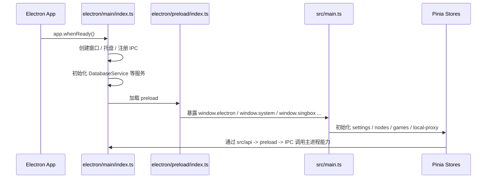

# LagZero 开发指南

## 1. 项目定位

LagZero 是一个面向游戏加速场景的桌面客户端，主要由以下几部分组成：

- 渲染进程：`Vue 3 + Pinia + Vue Router + Naive UI + UnoCSS`
- 主进程：`Electron`
- 网络内核：`sing-box`
- 数据存储：`better-sqlite3 + Kysely`
- 测试：`Vitest + happy-dom`

项目采用 Hash 路由，并同时维护主窗口与托盘窗口两套入口视图。

## 2. 环境准备

### 基础要求

- Node.js `18+`
- `pnpm`
- Windows 环境下建议使用管理员权限运行开发环境，尤其是调试 TUN、系统代理和 DNS 相关逻辑时

### 安装与启动

```bash
pnpm install
pnpm rebuild:native
pnpm dev
```

### 为什么一定要执行 `pnpm rebuild:native`

项目依赖 `better-sqlite3`，它是原生模块。Electron 的 Node ABI 与普通 Node.js 不完全一致，如果不重建，开发阶段很容易遇到启动失败或 ABI 不匹配问题。

## 3. 常用命令

| 命令 | 作用 |
| --- | --- |
| `pnpm dev` | 启动 Vite + Electron 开发环境 |
| `pnpm build` | 执行 `vue-tsc -b` 后构建渲染进程产物 |
| `pnpm test` | 运行 Vitest 单元测试 |
| `pnpm pack` | 打包为未安装目录，便于验证桌面运行环境 |
| `pnpm dist` | 构建当前平台安装包 |
| `pnpm dist:win:all` | 构建 Windows x64/arm64 的 NSIS 与 Portable 包 |
| `pnpm rebuild:native` | 重建 Electron 原生依赖 |
| `pnpm rebuild:sqlite` | 仅重建 `better-sqlite3` |

## 4. 启动流程

### 主进程启动

`electron/main/index.ts` 是主进程总入口，主要负责：

- 设置 `userData` 路径与单实例锁
- 启用提权、CSP、CrashReporter、日志系统
- 创建主窗口与托盘窗口
- 实例化 `DatabaseService`、`SingBoxService`、`SystemService` 等核心服务
- 注册应用级 IPC、对话框 IPC、扫描 IPC 与更新 IPC

### 渲染进程启动

`src/main.ts` 是渲染进程入口，主要负责：

- 初始化运行时日志与延迟会话存储
- 挂载 `router`、`pinia`、`i18n`
- 在主窗口中初始化本地代理自动启动与节点监听逻辑
- 对托盘窗口 `#/tray` 做特判，避免执行不必要的业务初始化

### 启动顺序图



## 5. 日常开发建议

### 新增一个前端功能

推荐顺序：

1. 如果主渲染进程都要用到数据结构，先在 `shared/types/` 定义类型
2. 如果只是页面逻辑，先评估放进 `store` 还是 `composable`
3. 如果需要主进程能力，先在 `preload` 和 `src/api` 打通桥接
4. 页面层优先走 `store`，不要在组件里直接拼 IPC 调用链

### 新增一个 Electron 能力

推荐顺序：

1. 在 `electron/services/` 新建或扩展服务
2. 在服务中注册 `ipcMain.handle(...)`
3. 在 `electron/preload/index.ts` 暴露到 `window.*`
4. 在 `src/api/*.ts` 增加薄封装
5. 在 `store` 或 `composable` 中消费

### 新增一个设置项

推荐落点：

- 持久化设置：`src/stores/settings.ts`
- 设置界面：`src/components/settings/`
- 若会影响加速流程：同步检查 `src/stores/games.ts`、`src/stores/local-proxy.ts`、`src/utils/singbox-config.ts`

### 新增一个游戏平台扫描器

推荐顺序：

1. 在 `electron/services/scanners/` 新增平台扫描器
2. 在 `electron/services/game-scanner.ts` 注册到 `scanners` 列表
3. 复用现有 `ScanProgressCallback`、`dedupeProcessNames`、`normalizeFsPath` 等工具
4. 通过 `useGameScanner()` 触发扫描，并让 `gameStore` 负责入库

## 6. 开发时需要特别注意的约束

- 渲染进程不要直接暴露或使用 `ipcRenderer`，统一经过 `preload`
- `shared/` 层不要依赖 Vue、Electron 或浏览器对象
- 托盘窗口走 `#/tray`，`src/main.ts` 已明确跳过本地代理自动初始化
- `generateSingboxConfig()` 是加速配置的单一出口，改代理规则优先改这里
- 本地代理与游戏加速共用 sing-box 进程，变更逻辑时要同时考虑 `games` 与 `local-proxy` 两条链路

## 7. 测试与验证

### 单元测试

```bash
pnpm test
```

当前测试主要覆盖：

- 协议解析
- sing-box 配置生成
- 代理监控逻辑
- Steam 扫描器与扫描工具
- 主题逻辑
- 分类管理和 JSON store

### 手动验证建议

- 节点导入、节点测速、订阅刷新
- 游戏扫描、游戏启动/停止加速
- TUN 与系统代理两种模式切换
- 本地代理自动选点与健康检查
- 托盘状态同步、主窗口关闭行为、应用重置
