# electron/services/scanners 重解读（功能增删与优化决策版）

更新时间：2026-03-05  
适用代码：`electron/services/scanners/*` + `electron/services/game-scanner.ts` 及其联动链路

## 0. 这份文档解决什么问题

你要做的是：

1. 功能增删（新增/移除平台、改扫描策略、改字段）
2. 再决定优化（性能、稳定性、维护成本）

这份文档按“先看清系统，再做改造”组织，重点回答：

- 当前模块到底做了哪些功能
- 每个功能用什么技术实现
- 扫描结果会联动哪些模块
- 哪些点改起来风险高/耦合重
- 你应该先改哪里，后改哪里

## 1. 模块总览

### 1.1 目录结构与职责

`electron/services/scanners` 目录当前包含：

- `types.ts`: 扫描统一类型与过滤常量
- `utils.ts`: 通用工具层（并发、目录扫描、exe 评分、图标提取、路径标准化）
- `steam.ts`: Steam 扫描器
- `microsoft.ts`: Microsoft Store / Xbox 扫描器
- `epic.ts`: Epic 扫描器
- `ea.ts`: EA 扫描器
- `battlenet.ts`: Battle.net 扫描器
- `wegame.ts`: WeGame 扫描器
- `local.ts`: 本地快捷方式扫描器
- `flat.ts`: 通用“平铺目录扫描器”（Epic/EA/Microsoft 复用）

聚合入口不在该目录，而在：

- `electron/services/game-scanner.ts`

### 1.2 统一结果模型（所有扫描器必须遵守）

```ts
type LocalGameScanResult = {
  name: string;
  processName: string[];
  source:
    | "Steam"
    | "Microsoft"
    | "Epic"
    | "EA"
    | "BattleNet"
    | "WeGame"
    | "Local"
    | "GOG";
  installDir: string;
  iconUrl?: string;
};
```

这 5 个字段是该系统最核心的“数据契约”。

## 2. 端到端链路（扫描结果如何流动）

```mermaid
flowchart LR
  A["Renderer useGameScanner.scanGames()"] --> B["Preload system.scanLocalGames()"]
  B --> C["Main IPC: system:scan-local-games"]
  C --> D["GameScannerService.scanLocalGamesFromPlatforms()"]
  D --> E["各平台 scanner"]
  E --> F["LocalGameScanResult[]"]
  F --> G["autoAddGamesFromLibraryScan() 自动入库"]
  G --> H["Database games.process_name 保存"]
  H --> I["ProxyMonitor 读取 processName"]
  I --> J["SingBoxConfigManager.updateProcessNames()"]
```



进度事件协议：

- `system:scan-progress` 事件
- `status` 目前约定值：`scanning_platform` / `scanning_dir`

对应联动代码：

- Main IPC: `electron/main/index.ts`
- Preload 暴露: `electron/preload/index.ts`
- 前端消费: `src/composables/useGameScanner.ts`

## 3. 技术实现清单（扫描到底用了什么技术）

### 3.1 文件系统与路径

- `fs-extra`: `readdir/stat/pathExists/readFile/readJSON`
- `path`: 目录拼接、标准化
- `os`: CPU 核数/用户目录

### 3.2 系统信息采集（Windows）

- PowerShell + 注册表查询（通过 `runCommand('powershell', ...)`）
- 查询来源：
  - Steam 注册表
  - 卸载项注册表（EA/BattleNet/Microsoft 提示）
  - WeGame 注册表
  - `Get-AppxPackage`（Microsoft）

### 3.3 Electron 原生能力

- `nativeImage.createFromPath()`：从 exe 抽图标 data URL
- `shell.readShortcutLink()`：解析 `.lnk` 目标路径

### 3.4 并发控制（核心）

`mapWithConcurrency()` 是全模块通用执行器：

- 固定 worker 数量
- 任务索引共享
- 避免 `Promise.all` 一次性打满 I/O

并发参数分布（当前代码）：

- 平台聚合并发：4（`GameScannerService`）
- 多数目录层并发：4~8
- 盘符探测并发：8

### 3.5 启发式识别（主进程挑选）

核心算法：`pickRelatedExecutables()`

- 分阶段深度扫描：2 -> 4 -> 6
- 快速评分：
  - 文件名与目标名匹配度
  - 路径中 `shipping/win64/binaries` 等特征
  - `launcher` 降噪
  - 软过滤关键词降权
- 二次评分：文件体积补分（`stat`）
- 结果截断：最多取 4 个

## 4. 通用层深解（types.ts + utils.ts）

### 4.1 `types.ts` 的过滤体系

过滤分 3 层：

1. 目录硬过滤：`GAME_SCAN_IGNORE_DIR_NAMES`
2. 可执行文件硬过滤：`GAME_SCAN_IGNORE_EXE_KEYWORDS`
3. 文件名硬排除：`GAME_SCAN_EXE_HARD_EXCLUDE`

再加一层软过滤：

- `GAME_SCAN_SOFT_IGNORE_EXE_KEYWORDS`（只降权，不直接丢弃）

这套设计兼顾了“减少误报”和“避免误杀”。

### 4.2 `normalizeFsPath()` 的作用

- 路径 normalize
- 去尾部分隔符
- 转小写

这是跨平台扫描器最终去重的关键函数。

### 4.3 `getWindowsDriveRoots()`（当前实现）

- 每次调用都重新并发探测 `C:` 到 `Z:`
- 不做盘符结果缓存

优点：实时性高（插拔盘符后能即时反映）  
代价：不同扫描器会重复探测盘符。

### 4.4 `pickGameIconDataUrl()`（当前实现）

- 图标结果不缓存
- 只缓存 `nativeImage` API 句柄（模块级）
- 候选 exe 只看前 4 个

优点：逻辑简单、不会有旧缓存污染  
代价：跨平台/跨轮扫描时会重复读取同一 exe 图标。

### 4.5 `collectExePaths()`：已从递归改为迭代任务队列

当前行为：

- 维护 `pending` 队列（`{dir, depth}`）
- 按深度限制推进
- 大目录优先级裁剪子目录（最多 120）
- 目录去重 `visited`

你需要特别注意的现实情况：

- 当前 `workerCount` 初始化受 `pending.length` 影响，初始基本为 1，等价于单 worker 扫描。  
  这意味着虽然代码形态是“并发 worker”，实际常常是串行队列。

这个点在你后续做性能优化时值得优先评估。

## 5. 各平台扫描器详解

## 5.1 Steam（`steam.ts`）

实现策略：清单优先 + 目录兜底

流程：

1. 盘符推导候选 Steam 根目录
2. 限制性嗅探 `steamapps`，避免全盘暴扫
3. 读注册表补充 Steam 安装根目录
4. 解析 `steamapps/libraryfolders.vdf`（兼容新旧格式）
5. 扫 `appmanifest_*.acf`：
   - 读取 `name` / `installdir` / `StateFlags`
   - 若 `StateFlags` 表示未安装则跳过
6. 对安装目录执行 `pickRelatedExecutables`
7. 若该库存在 manifest，则不再深扫 `steamapps/common`

技术亮点：

- `libraryfolders.vdf` 新旧格式兼容
- 基于 manifest 的 I/O 节流策略

## 5.2 Microsoft（`microsoft.ts`）

实现策略：目录扫描 + Appx 包扫描 + 名称提示修正

流程：

1. `XboxGames` 根目录平铺扫描（`scanFlatPlatformFolder`）
2. `Get-AppxPackage` 获取安装位置
3. 读取 `AppxManifest.xml` 判断是否“像游戏”
4. 通过 `DisplayName/Identity Name` 解析名称
5. 合并 base 与 appx 结果（按 installDir）
6. 再用注册表 hints + manifest hints 做名称修正

关键技术：

- XML 文本正则解析
- 多来源结果融合 + 最长路径提示优先

## 5.3 Epic（`epic.ts`）

实现策略：manifest 优先，平铺目录兜底

流程：

1. 读取 `%ProgramData%/.../Manifests/*.item`
2. 用 `InstallLocation + DisplayName/AppName`
3. 若有 `LaunchExecutable`，优先作为进程名候选
4. 再跑 `pickRelatedExecutables` 追加进程名
5. 平铺目录兜底扫描（`scanFlatPlatformFolder('Epic', roots)`）

## 5.4 EA（`ea.ts`）

实现策略：注册表双通道 + 平铺兜底 + 启动器排除

流程：

1. 专有 EA 注册表读取 `Install Dir`
2. 卸载项注册表读取 `DisplayName + InstallLocation`
3. 合并 hints，统一扫描函数 `scanEAHintInstall`
4. 排除 `EA app / EA desktop / Origin` 启动器
5. 平铺目录兜底，且附加目录过滤钩子

## 5.5 BattleNet（`battlenet.ts`）

实现策略：注册表 hints + 一级目录可疑项扫描

流程：

1. 卸载项注册表收集候选
2. 过滤 launcher/agent/updater
3. 判断游戏目录特征：
   - `.build.info` 存在
   - 或目录名命中游戏关键词
4. fallback：在 `Games/Game/Program Files` 一级扫可疑目录

特征：

- BattleNet 识别更依赖“目录特征+关键词”，准确率受目录命名影响较大。

## 5.6 WeGame（`wegame.ts`）

实现策略：注册表根目录 + 容器目录展开

流程：

1. 读腾讯 WeGame 注册表路径
2. 组合常见安装根
3. 对 `rail_apps/common_apps/apps/games` 容器做二层展开
4. 跳过 cache/log/temp/patch 等非游戏目录

## 5.7 Local（`local.ts`）

实现策略：快捷方式反查 exe

流程：

1. 递归扫描桌面和开始菜单（深度 <= 3）找 `.lnk`
2. `shell.readShortcutLink()` 拿 target
3. 排除浏览器/系统目录/Office 等路径
4. 基于 target 所在目录再执行 `pickRelatedExecutables`

说明：

- 这里仍是递归 `collectLnks()`，并未迭代化。

## 5.8 Flat（`flat.ts`）

这是“平台复用模板”，做三件事：

1. 扫 root 的一级目录
2. 可选目录过滤（`ignoreDirNames`, `shouldIncludeDir`）
3. 每个目录执行 `pickRelatedExecutables`

这个文件是后续做“平台插件化”最好的抽象基础。

## 6. 聚合器（`game-scanner.ts`）

### 6.1 聚合流程

- 同时运行 7 个扫描器（并发上限 4）
- 将各平台结果拼接后统一去重

### 6.2 去重策略

第一优先级：`installDir` 归一化后作为 key  
第二优先级：无 installDir 时，`name + sorted(processName)`

冲突合并策略：

- `name` 选长度更长的
- `processName` 合并去重
- `iconUrl` 取已有优先

### 6.3 额外接口

`scanDir()` 用于“手动选目录扫描 exe”，当前仍使用递归实现。

## 7. 联动与耦合（必须清楚）

## 7.1 IPC 协议耦合

- 主进程 channel：`system:scan-local-games`
- 进度事件：`system:scan-progress`
- 前端写死了 `scanning_platform/scanning_dir` 两个状态解释逻辑

改这些名字或状态值，会直接影响 UI 展示。

## 7.2 前端自动入库耦合

`useGameScanner.autoAddGamesFromLibraryScan()` 会：

- 按 `source` 自动创建平台分类（使用 `PLATFORMS`）
- 用 `name+process` 去重
- 调 `categoryApi.match` 自动匹配分类

所以 `source` 与 `processName` 的语义变化会影响入库行为。

## 7.3 数据库耦合

`DatabaseService.saveGame()`：

- `processName` 最终写入 `games.process_name`（JSON 字符串）
- `getAllGames()` 再解析为数组返回

字段兼容性要求：

- 扫描层始终保证 `processName: string[]`
- 避免输出路径形式（最好仅文件名）

## 7.4 代理链路耦合（最关键）

`proxy-monitor` + `singbox/config` 直接依赖扫描得到的进程名：

1. `ProxyMonitorService.startMonitoring(gameId, processNames)` 接收初始进程
2. 归一化后监控进程树，每 3 秒轮询
3. 发现子进程后更新 monitored set
4. `SingBoxConfigManager.updateProcessNames()` 更新 route/dns 规则中的 `process_name`

如果扫描器输出噪声进程，会导致代理规则扩大，带来副作用。

## 8. 当前功能清单（你可以据此做增删）

模块当前已经具备：

1. 多平台自动发现（Steam/Microsoft/Epic/EA/BattleNet/WeGame/Local）
2. 平台级并发扫描
3. 游戏进程多候选输出（不是单 exe）
4. 图标提取（可选）
5. 统一去重与结果合并
6. 扫描进度实时推送给前端
7. 自动入库与分类关联
8. 与运行时代理规则联动

## 9. 性能与复杂度观察（基于当前实现）

## 9.1 已做的控制

- 多层并发限流（避免 I/O 风暴）
- 大目录子目录截断（3000+ 条目）
- 分阶段深度探测（2/4/6）
- Steam manifest 优先，减少 common 深扫
- 图标提取最多探测 4 个 exe

## 9.2 当前热点

1. 多平台重复调用 `getWindowsDriveRoots()`（每次全探测）
2. PowerShell 调用较多（冷启动明显）
3. `pickRelatedExecutables` 仍是最重路径（目录遍历/评分/stat）
4. 本地快捷方式扫描仍递归
5. `collectExePaths` 迭代队列当前 worker 并发度偏低（常为 1）

## 9.3 稳定性风险点

- 大量 `catch { return null }` 吞错，问题定位依赖人工加日志
- 缺少取消机制，重复触发扫描会叠加资源占用
- 平台关键词策略（EA/BN/WeGame）易受安装路径命名差异影响

## 10. 功能增删时的改动清单

## 10.1 新增平台 scanner

建议步骤：

1. 新建 `electron/services/scanners/<platform>.ts`
2. 复用 `pickRelatedExecutables + pickGameIconDataUrl`
3. 在 `game-scanner.ts` 注册扫描器
4. 同步 `Platform`（`types.ts`）与前端 `PLATFORMS`（`src/constants/index.ts`）
5. 增加至少 2 类测试：命中样例 + 误报防护

## 10.2 移除平台 scanner

必须同步：

1. `game-scanner.ts` scanners 列表
2. `Platform` 类型
3. 前端 `PLATFORMS`（避免继续自动建分类）
4. 文案与 UI 过滤逻辑（如有）

## 10.3 改扫描结果字段

高风险字段：

- `processName`: 影响入库 + proxy-monitor + sing-box
- `source`: 影响分类与 UI
- `installDir`: 影响全局去重正确性

## 11. 你做优化前建议先定的决策

建议先回答这 5 个问题，再动代码：

1. 目标是“首扫更快”还是“重复扫描更快”？
2. 可接受的漏报率上限是多少？
3. 是否允许增加缓存（盘符/图标/平台查询结果）？
4. 是否需要中断扫描（Abort）？
5. 优先优化哪个平台（Steam 还是 Microsoft/EA/BN）？

这会直接决定是做：

- 扫描算法优化
- 数据源策略优化
- 缓存策略优化
- 架构改造（平台插件化）

## 12. 测试覆盖现状

当前与扫描强相关的单测集中在 `tests/unit`：

- `scanner-utils.spec.ts`
  - 大目录根 exe 不丢失
  - 深度边界正确
  - 明显误报 exe 被过滤
- `steam-scanner.spec.ts`
  - 深层目录 exe 可被选出

缺口：

1. 平台扫描器端到端测试基本没有
2. IPC 进度事件协议无测试
3. 去重冲突策略无回归测试
4. 性能基准测试无自动化

## 13. 给你的落地建议（按顺序）

1. 先做“观测”：加每平台耗时/命中率/失败率日志
2. 修 `collectExePaths` 并发度（当前常为 1 的问题）
3. 再决定是否上缓存（你现在倾向不用缓存，可先不加）
4. 把 `local.ts` 的递归 `collectLnks` 迭代化（与 utils 保持一致）
5. 最后再做平台适配器抽象，降低后续功能增删成本

---

如果你下一步要开始“功能增删”，推荐先从 `flat.ts + game-scanner.ts` 的接口层入手，先稳住契约，再改各平台内部策略。

## 14. 附录：核心控制常量详解 (utils.ts)

这部分解释了 `electron/services/scanners/utils.ts` 中的核心常量，这些常量直接决定了整个游戏扫描器的性能（CPU/IO占用）、准确率和极端情况下的兜底保护行为。如果要修改这些值，请务必参考以下实例。

### I/O 与并发控制

#### `UV_THREADPOOL_SIZE`

- **当前设置**: `String(Math.max(4, os.cpus().length * 2))`
- **含义**: Node.js 底层 libuv 异步 I/O 线程池大小。
- **影响与示例**:
  - **调大**（例如 `os.cpus().length * 4`）：如果在 NVMe 固态硬盘上，可以并发读取更多文件状态，大幅缩短全盘探测或高深度目录的扫描时间；但在机械硬盘（HDD）上，过高的并发会导致磁头频繁寻道，反而会让扫描龟速进行。
  - **调小**（例如固定为 `4`，Node默认值）：对于深层文件夹，文件系统的 API (`fs.stat`, `fs.readdir`) 会因为排队严重饥饿，扫描整个机器所需时间呈倍数级增长。

#### `DEFAULT_IO_CONCURRENCY`

- **当前设置**: `Math.max(4, Math.min(16, os.cpus().length))`
- **含义**: 基于 Worker 队列的任务并发度（常用于目录级别的异步 map 操作），最高卡在 16。
- **影响与示例**:
  - **调大**（例如 `32`）：理论上瞬间能并行处理更多的子目录解析，但如果配合前面的 `UV_THREADPOOL_SIZE` 扩大，极易造成瞬间内存峰值（堆积大量 pending I/O 操作），导致 Electron 进程内存爆炸被系统 kill。
  - **调小**（例如 `2`）：安全但慢。每轮只探测两个目录，适合极其脆弱的存储设备，但整体扫描会肉眼可见地拖沓。

#### `DRIVE_DETECT_CONCURRENCY`

- **当前设置**: `8`
- **含义**: 找根目录时，向系统探测 `C:` ~ `Z:` 盘符并发请求数。
- **影响与示例**:
  - **调大**（例如 `24`）：会同时试图访问 A-Z 全部的盘符。在一些老旧机器或者带有“休眠的外接机械硬盘/局域网断网的网络映射盘”上，会导致防病毒软件频繁拦截扫描，或者引发较长时间的操作系 I/O 卡死休眠。
  - **调小**（例如 `1`）：必须等 `C:` 响应完才能访问 `D:`。如果 `D:` 恰好是一个断连的网络盘（Windows可能要等 15 秒才抛错），那扫描器的最初启动就会白白浪费这 15 秒甚至更多，用户体验极差。

### 启发式执行文件探测 (`pickRelatedExecutables`)

#### `PICK_EXE_DEPTH_STAGES`

- **当前设置**: `[2, 4, 6]`
- **含义**: 渐进式的目录探索深度。第一次在深度 2 找，没有或不满意再到 4 找，再没有就深入到 6。这是因为游戏主程序总是相对较浅，而插件、日志、引擎附属文件往往很深。
- **影响与示例**:
  - **增加**（例如 `[2, 5, 8]`）：如果一个游戏的目录极大，扫到第 8 层，文件数量会呈指数级爆炸。不但消耗大量算力和耗时，还容易把位于 `Game/Engine/Plugins/Media/ThirdParty/bin/test.exe` 这种无关甚至冲突的 exe 给翻出来。
  - **减少**（例如 `[2, 3]`）：扫描会变得极度敏捷，但这绝对会导致部分现代 3A 大作（常常嵌套很深，如 `[安装盘]/SteamLibrary/steamapps/common/GameName/EngineName/Binaries/Win64/game.exe` 往往涉及 4~6 层深度）的主执行文件被彻底遗漏，因为深度不够而提早放弃了。

#### `PICK_EXE_STAT_SAMPLE_LIMIT`

- **当前设置**: `40`
- **含义**: 如果浅层过滤出来的“疑似主程序 exe”非常多，我们最多只取前 40 个去做真正的 `fs.stat`(用来取文件大小补分)，超出的直接放弃处理。
- **影响与示例**:
  - **调大**（例如 `200`）：假设遇到了一个包含了成百上千小工具的 SDK 目录，这会产生 200 次真实的文件系统 `stat` 请求。速度会被拖慢。
  - **调小**（例如 `5`）：假设有 10 个看似匹配的 exe（包含各种 debug版、shipping版），由于限制，部分主程序在按字符串排序时落在了第 6 位，导致直接没有进入 `stat` 阶段没法获得“大文件加分”，最终挑出了一个 50KB 的 `Game_crash_reporter.exe` 而丢掉了 100MB 的 `Game.exe`。

#### `PICK_EXE_EARLY_ACCEPT_SCORE` 与 `PICK_EXE_EARLY_ACCEPT_COUNT`

- **当前设置**: 积分 `8`，数量 `4`
- **含义**: “见好就收”机制。如果目前深度已经发现至少 4 个得分 >= 8，立刻终止后续深度的进一步探索。这样可以迅速跳过已明确找到目标的游戏。
- **影响与示例**:
  - **调高阈值**（如分数为 `15` 或 数量 `10`）：基本上永远也触发不到这个提前结束机制。扫描器会对每个游戏文件夹都会死磕到最大深度 `6`，消耗的时间将是当前的几倍。
  - **调低阈值**（如分数 `4`，数量 `1`）：只要在根目录遇到随便一个满足低分阈值（比如名叫 `Launcher.exe` 积分刚好4分），它就停止进入真实的 `Binaries` 文件夹寻找 `Game.exe`。误报率会极速上升，捡了芝麻丢了西瓜。

#### `PICK_EXE_DEEP_FALLBACK_DEPTH`

- **当前设置**: `6`
- **含义**: 深度退避限制的兜底。防止意外或者递归逃逸死循环跑得过深。
- **影响与示例**:
  - 和 `PICK_EXE_DEPTH_STAGES` 对应，如果将其放宽，碰到畸形的套娃快捷方式或无限重定向的符号链接目录结构时，可能导致系统崩溃或爆栈。

### 大目录保护机制

#### `LARGE_DIR_ENTRY_THRESHOLD`

- **当前设置**: `3000`
- **含义**: 当某个目录下的直接文件+子目录条目数大于 3000 时，判定该目录过于庞杂（比如游戏截图堆、模型材质堆），进而启动子目录修剪防范机制。
- **影响与示例**:
  - **调大**（例如 `10000`）：对包含海量零散碎文件（比如《Garry's Mod》大量的 addons）的复杂软件放行会把队列堵死，导致一个游戏的耗时能占平时的 90%。
  - **调小**（例如 `200`）：非常容易导致误伤。比如一个普通的网游带有 200多个补丁文件在根目录，瞬间判定为“过于庞杂目录”，触发“放弃大部分子路径”的硬修剪，导致漏扫。

#### `LARGE_DIR_SUBDIR_SCAN_LIMIT`

- **当前设置**: `120`
- **含义**: 如果触发了上述 `3000` 的极度庞杂限制，该目录将被保护：只挑前 120 个具有潜力的子目录继续向下探索，其它所有的多余子目录原地绝育。
- **影响与示例**:
  - **调大**（例如 `1000`）：大目录修剪保护形同虚设，还是容易被一万个子文件夹打爆内存堆积。
  - **调小**（例如 `10`）：修剪得过于激进。如果真实的 `Binaries` 文件夹因为按字母排（或者没有包含在高优关键词里）排在第 15 个，那么这块游戏引擎就直接无了，扫描变瞎子。

#### `LARGE_DIR_PRIORITY_KEYWORDS`

- **当前设置**: `['bin', 'binaries', 'win64', 'win32', 'x64', 'x86', 'game', 'client', 'release', 'shipping', 'launcher']`
- **含义**: 配合 `LARGE_DIR_SUBDIR_SCAN_LIMIT` 用的“免死金牌”。大目录下挑出来的 120 个名额里，包含这些关键词的文件夹拥有插队绝对优先权。
- **影响与示例**:
  - **增加**（例如加上 `build` 或 `out`）：能让一些特殊的独立游戏或带有开发版本的客户端，在大目录修剪时依然活下来，提高对某些特别打包结构的识别精度。
  - **减少**（例如删掉 `win32`或`x86`）：那些仍然在使用十年前引擎的老游戏，一旦其目录变得庞大（累计了几千个文件）并触发了大目录保护，其 `win32` 目录可能会被随机丢弃，从而彻底丧失被扫描到的机会。
