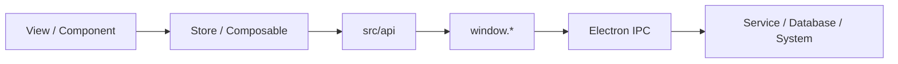

# 模块说明与使用方法

## 1. 通用调用链

在 LagZero 中，推荐遵循下面这条调用链：



原则上：

- 组件负责展示与交互
- `store` 负责跨页面业务状态
- `composable` 负责可复用逻辑
- `src/api` 是渲染进程调用主进程的薄封装
- `preload` 是唯一允许暴露主进程能力给渲染进程的地方

## 2. 前端模块

### 2.1 游戏模块

相关文件：

- `src/views/library/index.vue`
- `src/views/dashboard/index.vue`
- `src/stores/games.ts`
- `src/utils/singbox-config.ts`

职责：

- 管理游戏库、当前选中游戏、运行状态、延迟与加速时长
- 负责游戏加速的启动与停止
- 根据节点与设置生成 sing-box 配置
- 在进程模式下协调 `proxyMonitor`

常用方法：

- `init()`: 初始化游戏库
- `setCurrentGame(id)`: 切换当前游戏
- `addGame(game)`, `updateGame(game)`, `removeGame(id)`: 游戏 CRUD
- `startGame(id)`: 启动加速
- `stopGame(id)`: 停止加速
- `matchRunningGames(processNames)`: 根据进程名回填运行状态
- `applySessionNetworkTuningChange()`: 当前正在加速时重启应用配置

示例：

```ts
<script setup lang="ts">
import { useGameStore } from '@/stores/games'

const gameStore = useGameStore()

async function onStart(gameId: string) {
  await gameStore.startGame(gameId)
}

async function onStop(gameId: string) {
  await gameStore.stopGame(gameId)
}
</script>
```

使用建议：

- 如果只是编辑游戏资料，用 `addGame` / `updateGame`
- 如果涉及启停 sing-box，一律走 `startGame` / `stopGame`
- 修改加速规则时，优先检查 `generateSingboxConfig()` 是否也要更新

### 2.2 节点模块

相关文件：

- `src/views/nodes/index.vue`
- `src/components/node/*`
- `src/stores/nodes.ts`
- `src/utils/protocol.ts`

职责：

- 管理节点列表、筛选、排序、分组与多选
- 导入/导出分享链接
- 节点订阅刷新
- 延迟测速与会话统计

常用方法：

- `loadNodes()`: 从数据库加载节点
- `saveNode(node)`: 保存节点
- `addNodes(content)`: 从分享链接文本导入节点
- `removeNode(id)`, `removeNodes(ids)`: 删除节点
- `refreshSubscription(id)`: 手动刷新订阅
- `runScheduledSubscriptions(reason)`: 按启动或手动场景执行订阅刷新
- `checkNode(node, methodOverride?, context?)`: 测单个节点
- `checkAllNodes()`: 批量测速

示例：

```ts
<script setup lang="ts">
import { useNodeStore } from '@/stores/nodes'

const nodeStore = useNodeStore()

await nodeStore.loadNodes()
await nodeStore.checkAllNodes()

const importedCount = await nodeStore.addNodes(shareLinksText)
console.log('imported:', importedCount)
</script>
```

使用建议：

- 页面层不要自己解析节点分享链接，统一复用 `addNodes`
- 订阅刷新默认会做去重，手动导入允许重复
- 如果删除节点会影响当前加速中的游戏，`nodes` store 已内置停机兜底逻辑

### 2.3 本地代理模块

相关文件：

- `src/stores/local-proxy.ts`
- `src/main.ts`

职责：

- 应用启动时自动拉起本地代理
- 在可用节点中递归探测并选择健康节点
- 节点变更后自动切换或恢复
- 定时做本地代理健康检查

常用方法：

- `startLocalProxy(reason?)`
- `stopLocalProxy()`
- `recheckLocalProxyHealth()`
- `handleNodeListChanged()`
- `applySettingsChange()`

示例：

```ts
<script setup lang="ts">
import { useLocalProxyStore } from '@/stores/local-proxy'

const localProxyStore = useLocalProxyStore()

async function onProxySettingsChanged() {
  await localProxyStore.applySettingsChange()
}
</script>
```

使用建议：

- 不要在组件里直接拼测试端口、递归探测等流程，这些都已经封装在 store 中
- 这个模块与游戏加速共用 sing-box 进程，改动前要确认不会破坏 `games` store 的启停流程

### 2.4 设置模块

相关文件：

- `src/stores/settings.ts`
- `src/components/settings/*`
- `src/views/settings/index.vue`

职责：

- 持久化语言、主题、窗口关闭行为
- 持久化 DNS、检测方式、本地代理、系统代理与 TUN 相关设置
- 管理全局会话级网络调优参数

常用字段：

- `language`, `theme`, `themeColor`
- `windowCloseAction`
- `checkInterval`, `checkMethod`, `checkUrl`
- `dnsMode`, `dnsPrimary`, `dnsSecondary`, `dnsBootstrap`
- `localProxyEnabled`, `localProxyPort`
- `accelNetworkMode`, `systemProxyPort`, `systemProxyBypass`
- `tunInterfaceName`
- `sessionNetworkTuning`

常用方法：

- `resetSessionNetworkTuning()`
- `applySessionNetworkProfilePreset(profile, options?)`

示例：

```ts
<script setup lang="ts">
import { useSettingsStore } from '@/stores/settings'

const settingsStore = useSettingsStore()

settingsStore.accelNetworkMode = 'tun'
settingsStore.applySessionNetworkProfilePreset('aggressive', {
  isCurrentNodeVless: true
})
</script>
```

### 2.5 游戏扫描模块

相关文件：

- `src/composables/useGameScanner.ts`
- `electron/services/game-scanner.ts`
- `electron/services/scanners/*.ts`

职责：

- 调用主进程扫描本地游戏平台与本地快捷方式
- 自动匹配分类并写入游戏库
- 扫描运行进程并回填游戏运行状态

常用方法：

- `scanGames()`
- `isScanning`
- `scanProgressText`

示例：

```ts
<script setup lang="ts">
import { useGameScanner } from '@/composables/useGameScanner'

const { isScanning, scanProgressText, scanGames } = useGameScanner()
</script>
```

### 2.6 托盘模块

相关文件：

- `src/views/tray/index.vue`
- `electron/main/tray.ts`
- `src/layouts/MainLayout.vue`

职责：

- 展示当前游戏、延迟、丢包与加速时长
- 提供快速启停、显示主窗口与退出应用操作
- 与主窗口通过托盘状态快照同步

注意点：

- 托盘页走 `#/tray`
- `src/main.ts` 对托盘窗口做了特判，不会初始化主窗口的本地代理监听逻辑

## 3. Electron 主进程模块

### 3.1 `DatabaseService`

文件：`electron/services/database.ts`

职责：

- 初始化 SQLite 数据库
- 管理 `nodes`、`games`、`categories` 等核心数据
- 做数据迁移、默认分类补齐、分类与标签冲突修复

建议：

- 业务数据落库优先经过这个服务
- `GameService` / `NodeService` / `CategoryService` 只是它的 IPC 薄封装

### 3.2 `SingBoxService`

文件：`electron/services/singbox/index.ts`

职责：

- 下载和校验 sing-box 二进制
- 启动、停止、重启 sing-box 进程
- 采集日志并转发到渲染进程
- 处理进程路由规则更新

对应 IPC：

- `singbox-start`
- `singbox-stop`
- `singbox-restart`
- `singbox-ensure-core`
- `singbox-get-install-info`

### 3.3 `SystemService`

文件：`electron/services/system.ts`

职责：

- `ping` / `tcpPing`
- DNS 刷新
- TUN 网卡重装
- 系统代理设置与恢复
- 本地 HTTP 代理连通性测试
- 主进程代理 HTTP 请求

适用场景：

- 节点测速
- 本地代理健康检查
- 系统代理模式切换
- 网络诊断工具

### 3.4 `ProxyMonitorService`

文件：`electron/services/proxy-monitor.ts`

职责：

- 按游戏进程名轮询进程树
- 找出链式拉起的子进程
- 将新发现的子进程同步给 sing-box 动态代理

适用场景：

- `proxyMode = 'process'`
- `chainProxy = true`

### 3.5 `GameScannerService`

文件：`electron/services/game-scanner.ts`

职责：

- 并发调用多个平台扫描器
- 去重安装目录和进程名
- 提供目录扫描能力给“选择文件夹导入进程”功能

当前已接入平台：

- Steam
- Microsoft
- Epic
- EA
- BattleNet
- WeGame
- Local shortcut

### 3.6 `WindowManager` 与 `TrayManager`

文件：

- `electron/main/window.ts`
- `electron/main/tray.ts`

职责：

- `WindowManager`: 主窗口创建、窗口关闭行为管理、开发者工具、主窗口 IPC
- `TrayManager`: 托盘图标、托盘浮窗、显示主窗口、退出应用

注意点：

- 关闭按钮行为可配置为 `ask / minimize / quit`
- 托盘浮窗是独立 `BrowserWindow`，不是原生菜单

## 4. 渲染进程与主进程之间怎么接

推荐固定模板：

1. `electron/services/*` 或 `electron/main/index.ts` 注册 IPC
2. `electron/preload/index.ts` 通过 `contextBridge.exposeInMainWorld` 暴露
3. `src/api/*.ts` 包装成统一调用方法
4. `src/stores/*` 或 `src/composables/*` 负责消费
5. `src/views/*` / `src/components/*` 只调用上层封装

示例路径：

```text
src/views/nodes/index.vue
  -> src/stores/nodes.ts
  -> src/api/nodes.ts
  -> window.nodes.*
  -> ipcMain.handle('nodes:*')
  -> electron/services/node.ts
  -> electron/services/database.ts
```

## 5. 扩展建议

### 新增一个 IPC 能力

最推荐的文件落点：

- 主进程逻辑：`electron/services/xxx.ts`
- 桥接层：`electron/preload/index.ts`
- 渲染进程 API：`src/api/xxx.ts`
- 业务状态：`src/stores/xxx.ts` 或 `src/composables/useXxx.ts`

### 新增一个共享数据结构

最推荐的文件落点：

- `shared/types/*.ts`
- 渲染进程 re-export：`src/types/index.ts`

### 新增一个系统级功能

优先判断是否属于下面其中一种：

- 文件系统、网络诊断、端口检查、系统代理：加到 `SystemService`
- sing-box 生命周期和配置校验：加到 `SingBoxService`
- 业务数据 CRUD：加到 `DatabaseService`
- 游戏平台扫描：加到 `GameScannerService` 或 `scanners/`

## 6. 维护时最容易踩坑的点

- 直接在组件里调用 `window.*`，会让调用链分散，后期难维护
- 修改节点结构却忘了同步 `shared/types`、数据库和协议解析
- 只改游戏加速逻辑，没考虑本地代理复用同一 sing-box 进程
- 给托盘页加主窗口初始化逻辑，导致托盘窗口触发多余副作用
- 在 `shared/` 里引入 Electron 或 Vue，导致跨进程复用失败
