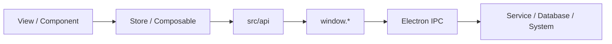

# 模块说明与使用方法

## 1. 通用调用链

在 LagZero 中，推荐遵循下面这条调用链：



原则上：

- 组件负责展示与交互
- `store` 负责跨页面业务状态
- `composable` 负责复用逻辑
- `src/api` 是渲染进程调用主进程的薄封装
- `preload` 是唯一允许暴露主进程能力给渲染进程的地方

## 2. 渲染进程模块

### 2.1 游戏模块

相关文件：

- `src/views/library/index.vue`
- `src/views/dashboard/index.vue`
- `src/stores/games.ts`
- `src/utils/singbox-config.ts`

职责：

- 管理游戏库、当前选中游戏、运行状态、延迟与加速时长
- 负责游戏加速的启动与停止
- 根据节点与设置生成 sing-box 配置
- 在进程模式下协调 `proxyMonitor`

常用方法：

- `init()`
- `setCurrentGame(id)`
- `addGame(game)` / `updateGame(game)` / `removeGame(id)`
- `startGame(id)` / `stopGame(id)`
- `matchRunningGames(processNames)`
- `applySessionNetworkTuningChange()`

使用建议：

- 编辑游戏资料优先走 `addGame` / `updateGame`
- 涉及 sing-box 启停一律走 `startGame` / `stopGame`
- 改代理规则时，优先检查 `generateSingboxConfig()` 是否也需要同步调整

### 2.2 节点与订阅模块

相关文件：

- `src/views/nodes/index.vue`
- `src/components/node/*`
- `src/stores/nodes.ts`
- `src/utils/protocol.ts`

职责：

- 管理节点列表、筛选、排序、分组与多选
- 导入 / 导出分享链接
- 解析 Clash YAML 与 Base64 订阅内容
- 管理订阅创建、更新、手动刷新与启动自动刷新
- 执行单点测速与批量测速

常用方法：

- `loadNodes()`
- `saveNode(node)`
- `addNodes(content)`
- `removeNode(id)` / `removeNodes(ids)`
- `upsertSubscription(payload)`
- `refreshSubscription(id)`
- `runScheduledSubscriptions(reason)`
- `checkNode(node, methodOverride?, context?)`
- `checkAllNodes()`

使用建议：

- 页面层不要自己解析节点分享链接，统一复用 `addNodes`
- deep link 导入订阅时，统一走 `upsertSubscription`
- 删除节点会影响当前加速中的游戏时，`nodes` store 已内置停机兜底逻辑

### 2.3 本地代理模块

相关文件：

- `src/stores/local-proxy.ts`
- `src/main.ts`
- `src/constants/index.ts`

职责：

- 应用启动时自动拉起本地代理
- 在可用节点中递归探测并选择健康节点
- 节点变更后自动切换或恢复
- 定时做本地代理健康检查

常用方法：

- `startLocalProxy(reason?)`
- `stopLocalProxy()`
- `recheckLocalProxyHealth()`
- `handleNodeListChanged()`
- `applySettingsChange()`

使用建议：

- 不要在组件里直接拼“找端口、测代理、切节点、重启 sing-box”的流程
- 这个模块与游戏加速共用 sing-box 进程，改动前要确认不会破坏 `games` store 的启停链路

### 2.4 设置模块

相关文件：

- `src/stores/settings.ts`
- `src/components/settings/*`
- `src/views/settings/index.vue`

职责：

- 持久化语言、主题、窗口关闭行为
- 持久化 DNS、测速、本地代理、系统代理、TUN、协议守护等设置
- 管理会话级网络调优参数和 sing-box 首选核心版本

重点字段：

- `language` / `theme` / `themeColor`
- `windowCloseAction`
- `clashProtocolGuardEnabled` / `mihomoProtocolGuardEnabled`
- `checkInterval` / `checkMethod` / `checkUrl`
- `dnsMode` / `dnsPrimary` / `dnsSecondary` / `dnsBootstrap`
- `localProxyEnabled` / `localProxyPort` / `localProxyNodeRecursiveTest`
- `accelNetworkMode` / `systemProxyPort` / `systemProxyBypass`
- `tunInterfaceName`
- `singboxCoreVersion`
- `sessionNetworkTuning`

常用方法：

- `resetSessionNetworkTuning()`
- `applySessionNetworkProfilePreset(profile, options?)`

### 2.5 分类模块

相关文件：

- `src/stores/categories.ts`
- `src/api/categories.ts`

职责：

- 加载分类列表
- 维护分类的新增、编辑、删除
- 为游戏扫描和手动建档提供分类基础数据

常用方法：

- `loadCategories()`
- `addCategory(category)`
- `updateCategory(category)`
- `removeCategory(id)`

### 2.6 sing-box 安装器模块

相关文件：

- `src/stores/singbox-installer.ts`
- `src/components/singbox/SingboxInstallerGuard.vue`
- `src/api/singbox.ts`

职责：

- 查询当前核心是否安装
- 拉取可用版本列表
- 安装或重装指定版本
- 接收主进程下发的安装进度事件

常用方法：

- `initialize()`
- `refreshInstallInfo()`
- `refreshCoreVersions(forceRefresh?)`
- `installCore(preferredVersion?)`

使用建议：

- 如页面需要感知核心安装状态，优先复用 store，不要直接在组件里拼事件监听逻辑
- 修改安装阶段或事件字段时，记得同步 `electron/preload/index.ts` 和类型定义

### 2.7 游戏扫描模块

相关文件：

- `src/composables/useGameScanner.ts`
- `electron/services/game-scanner.ts`
- `electron/services/scanners/*.ts`

职责：

- 调用主进程扫描本地游戏平台与本地快捷方式
- 自动匹配分类并写入游戏库
- 扫描运行进程并回填游戏运行状态

常用状态 / 方法：

- `scanGames()`
- `isScanning`
- `scanProgressText`

### 2.8 应用、更新与日志模块

相关文件：

- `src/api/app.ts`
- `src/composables/useAppUpdater.ts`
- `src/layouts/MainLayout.vue`

职责：

- 获取版本号、检查更新
- 打开目录、打开外部链接、重启或重置应用
- 读取与清理应用日志
- 消费 pending deep link 导入任务

常用方法：

- `appApi.getVersion()`
- `appApi.checkUpdate()`
- `appApi.getProtocolGuardState(scheme)`
- `appApi.setProtocolGuardEnabled(scheme, enabled)`
- `appApi.consumePendingDeepLinkImports()`
- `logsApi.getAll()` / `logsApi.clear()` / `logsApi.getFilePath()`

### 2.9 托盘与主布局模块

相关文件：

- `src/layouts/MainLayout.vue`
- `src/views/tray/index.vue`
- `src/api/electron.ts`

职责：

- 主窗口布局、导航、窗口控制按钮
- 托盘窗口状态同步
- 版本检查入口与关闭确认逻辑
- 在布局层消费 deep link 队列并触发订阅导入

注意点：

- 托盘页走 `#/tray`
- `src/main.ts` 已对托盘窗口做特判，不会初始化主窗口的本地代理逻辑

## 3. Electron 主进程模块

### 3.1 `DatabaseService`

文件：`electron/services/database.ts`

职责：

- 初始化 SQLite 数据库
- 管理 `nodes`、`games`、`categories` 等核心数据
- 做数据迁移、默认分类补齐、分类与标签冲突修复

建议：

- 业务数据落库优先经过这个服务
- `GameService` / `NodeService` / `CategoryService` 主要是它的 IPC 薄封装

### 3.2 `SingBoxService`

文件：`electron/services/singbox/index.ts`

职责：

- 下载和校验 sing-box 二进制
- 启动、停止、重启 sing-box 进程
- 采集日志并转发到渲染进程
- 处理进程路由规则更新

对应 IPC：

- `singbox-start`
- `singbox-stop`
- `singbox-restart`
- `singbox-ensure-core`
- `singbox-install-core`
- `singbox-list-core-versions`
- `singbox-get-install-info`

### 3.3 `SystemService`

文件：`electron/services/system.ts`

职责：

- `ping` / `tcpPing`
- DNS 刷新
- TUN 网卡重装
- 系统代理设置与恢复
- 本地 HTTP 代理连通性测试
- 由主进程执行 HTTP GET 请求，绕过渲染进程 CORS

适用场景：

- 节点测速
- 本地代理健康检查
- 系统代理模式切换
- 网页订阅拉取
- 网络诊断工具

### 3.4 `ProxyMonitorService`

文件：`electron/services/proxy-monitor.ts`

职责：

- 按游戏进程名轮询进程树
- 找出链式拉起的子进程
- 将新发现的子进程同步给 sing-box 动态代理

适用场景：

- `proxyMode = 'process'`
- `chainProxy = true`

### 3.5 `GameScannerService`

文件：`electron/services/game-scanner.ts`

职责：

- 并发调用多个平台扫描器
- 去重安装目录和进程名
- 提供目录扫描能力给“选择文件夹导入进程”功能

当前已接入来源：

- Steam
- Microsoft
- Epic
- EA
- BattleNet
- WeGame
- Local shortcut

### 3.6 `UpdaterService`

文件：`electron/services/updater.ts`

职责：

- 通过 GitHub Release 或 Tags 检查最新版本
- 返回版本号、发布日期和发布说明

注意点：

- 当前只负责“检查并提示”，不负责自动下载和自动安装

### 3.7 `WindowManager` 与 `TrayManager`

文件：

- `electron/main/window.ts`
- `electron/main/tray.ts`

职责：

- `WindowManager`：主窗口创建、关闭行为管理、开发者工具、主窗口 IPC
- `TrayManager`：托盘图标、托盘浮窗、显示主窗口、退出应用

注意点：

- 关闭按钮行为可配置为 `ask / minimize / quit`
- 托盘浮窗是独立 `BrowserWindow`，不是原生菜单

### 3.8 Deep link 与协议守护

文件：

- `electron/main/deep-link.ts`
- `electron/main/protocol-client.ts`
- `electron/main/index.ts`

职责：

- 解析 `lagzero://`、`clash://`、`mihomo://`
- 在单实例场景下转发二次启动的 deep link
- 维护 `clash://`、`mihomo://` 是否仍由 LagZero 持有

使用建议：

- 新增参数或动作时，优先改 `deep-link.ts`
- 协议注册策略、守护开关与 ownership 判断，优先改 `protocol-client.ts`

## 4. 渲染进程与主进程之间怎么接

推荐固定模板：

1. `electron/services/*` 或 `electron/main/index.ts` 注册 IPC
2. `electron/preload/index.ts` 通过 `contextBridge.exposeInMainWorld` 暴露
3. `src/api/*.ts` 包装成统一调用方法
4. `src/stores/*` 或 `src/composables/*` 负责消费
5. `src/views/*` / `src/components/*` 只调用上层封装

示例路径：

```text
src/views/nodes/index.vue
  -> src/stores/nodes.ts
  -> src/api/nodes.ts
  -> window.nodes.*
  -> ipcMain.handle('nodes:*')
  -> electron/services/node.ts
  -> electron/services/database.ts
```

## 5. 扩展建议

### 新增一个 IPC 能力

最推荐的文件落点：

- 主进程逻辑：`electron/services/xxx.ts`
- 桥接层：`electron/preload/index.ts`
- 渲染进程 API：`src/api/xxx.ts`
- 业务状态：`src/stores/xxx.ts` 或 `src/composables/useXxx.ts`

### 新增一个共享数据结构

最推荐的文件落点：

- `shared/types/*.ts`
- 渲染进程 re-export：`src/types/index.ts`

### 新增一个系统级功能

优先判断属于下面哪一类：

- 文件系统、网络诊断、端口检查、系统代理：加到 `SystemService`
- sing-box 生命周期和安装管理：加到 `SingBoxService`
- 业务数据 CRUD：加到 `DatabaseService`
- 游戏平台扫描：加到 `GameScannerService` 或 `scanners/`
- 协议注册与守护：加到 `deep-link.ts` / `protocol-client.ts`

## 6. 维护时最容易踩坑的点

- 直接在组件里调用 `window.*`，会让调用链分散，后期难维护
- 修改节点结构却忘了同步 `shared/types`、数据库和协议解析
- 只改游戏加速逻辑，没考虑本地代理复用同一 sing-box 进程
- 给托盘页加主窗口初始化逻辑，导致托盘窗口触发多余副作用
- 在 `shared/` 里引入 Electron 或 Vue，导致跨进程复用失败
- 只改 deep link 页面提示，没有同步主进程解析和单元测试
