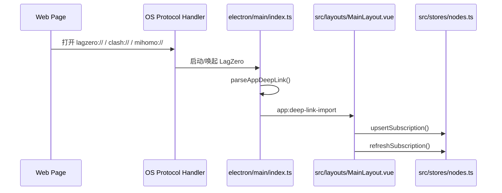

# 订阅深链导入说明

## 1. 功能概览

LagZero 支持通过网页或外部程序唤起桌面客户端，并自动创建或更新订阅。

当前兼容三类协议：

- `lagzero://`
- `clash://`
- `mihomo://`

当前兼容的动作名：

- `import`
- `install-config`
- `subscribe`
- `subscription`

这套能力主要用于“网页点击按钮 -> 唤起 LagZero -> 导入订阅 -> 可选立即刷新节点”。

## 2. 支持的链接格式

推荐优先使用：

```text
lagzero://import?url=<encoded-subscription-url>&name=<encoded-name>
```

兼容 Clash / Mihomo 风格：

```text
clash://install-config?url=<encoded-subscription-url>&name=<encoded-name>
mihomo://install-config?url=<encoded-subscription-url>&name=<encoded-name>
```

也支持以下别名：

```text
lagzero://install-config?url=<encoded-subscription-url>
lagzero://subscribe?url=<encoded-subscription-url>
lagzero://subscription?url=<encoded-subscription-url>
```

## 3. 参数说明

| 参数 | 必填 | 说明 |
| --- | --- | --- |
| `url` | 是 | 订阅地址，只接受 `http://` 或 `https://` |
| `name` | 否 | 订阅名称；不传时前端会根据地址生成兜底名称 |
| `schedule` | 否 | 自动更新策略，支持 `manual`、`startup`、`daily`、`monthly` |
| `immediate` | 否 | 是否在添加/更新订阅后立刻刷新，默认 `true` |

参数别名也可用：

- `url` 的别名：`subscription`、`config`
- `name` 的别名：`title`、`profile`
- `schedule` 的别名：`update`、`mode`
- `immediate` 的别名：`refresh`、`fetch`

默认行为：

- 未传 `schedule` 时，默认 `manual`
- 未传 `immediate` 时，默认 `true`
- 同一个订阅 URL 重复导入时，会更新现有订阅而不是新增重复项

## 4. 网页接入示例

### HTML 链接

```html
<a
  href="lagzero://import?url=https%3A%2F%2Fexample.com%2Fapi%2Fv1%2Fclient%2Fsubscribe%3Ftoken%3Dabc123&name=My%20Subscription"
>
  导入到 LagZero
</a>
```

### JavaScript 动态拼接

```ts
const subscriptionUrl = 'https://example.com/api/v1/client/subscribe?token=abc123'
const name = 'My Subscription'

const href =
  `lagzero://import?url=${encodeURIComponent(subscriptionUrl)}` +
  `&name=${encodeURIComponent(name)}` +
  `&schedule=manual`

window.location.href = href
```

### Clash 兼容写法

```ts
const subscriptionUrl = 'https://example.com/api/v1/client/subscribe?token=abc123'
window.location.href = `clash://install-config?url=${encodeURIComponent(subscriptionUrl)}`
window.location.href = `mihomo://install-config?url=${encodeURIComponent(subscriptionUrl)}`
```

## 5. 接入要求

### 对网页侧的要求

- `url` 必须做 URL 编码，尤其是订阅地址自身带有 `?token=`、`&flag=` 等查询参数时
- 订阅地址必须是 LagZero 可访问的 `http/https` 文本接口
- 如果希望“仅添加，不立即拉取”，显式传 `immediate=false`
- 如果希望“仅手动更新”，显式传 `schedule=manual`

### 对客户端环境的要求

- 需要使用桌面版 LagZero，浏览器环境本身不能直接解析订阅
- 应用需要至少启动过一次，系统才会注册 `lagzero://` / `clash://` / `mihomo://` 协议
- Windows 上如果已经安装其他 Clash / Mihomo 客户端，`clash://`、`mihomo://` 可能仍被其他软件占用；对外接入时更推荐使用 `lagzero://`
- Windows 运行期间，LagZero 会周期性检测 `clash://`、`mihomo://` 是否仍指向自己；如果被其他软件抢占，会自动尝试重新注册回来
- 建议优先验证打包后的安装版或便携版；开发模式下虽然也会调用协议注册，但系统是否接管仍取决于当前环境和默认协议处理器

### 对订阅内容的要求

- 订阅内容支持常见分享链接批量文本
- 订阅内容也支持 Clash YAML，或 Base64 编码后的 Clash YAML
- Clash 配置会从 `proxies:` 中提取可兼容节点
- 当前只会导入 LagZero 已支持的协议类型；不支持的 Clash 节点类型会被跳过

## 6. 导入后的行为

1. 主进程解析深链并校验参数
2. 渲染进程创建或更新订阅
3. 如果 `immediate !== false`，立即执行一次订阅刷新
4. 订阅内容导入后会自动分组到订阅名称下
5. 如果 `schedule=manual`，后续不会参与启动自动刷新，只能手动更新



## 7. 代码落点

- 协议解析：`electron/main/deep-link.ts`
- 协议注册与单实例转发：`electron/main/index.ts`
- preload 暴露：`electron/preload/index.ts`
- 渲染进程 API：`src/api/app.ts`
- 导入落地与提示：`src/layouts/MainLayout.vue`
- 订阅创建/更新/刷新：`src/stores/nodes.ts`
- Clash 订阅解析：`src/utils/protocol.ts`
- 打包协议声明：`package.json > build.protocols`

## 8. 开发约束

- 新增深链动作或参数时，优先改 `electron/main/deep-link.ts`，不要在页面组件里自行解析 URL
- 深链只接受 `http/https` 订阅地址，避免把本地文件或任意协议透传到渲染进程
- 改动协议参数后，需要同步更新 `tests/unit/deep-link.spec.ts`
- 改动 Clash 解析能力后，需要同步更新 `tests/unit/protocol.spec.ts`
- 面向第三方网页提供接入文档时，推荐始终给出 `lagzero://` 示例，把 `clash://`、`mihomo://` 作为兼容选项说明
